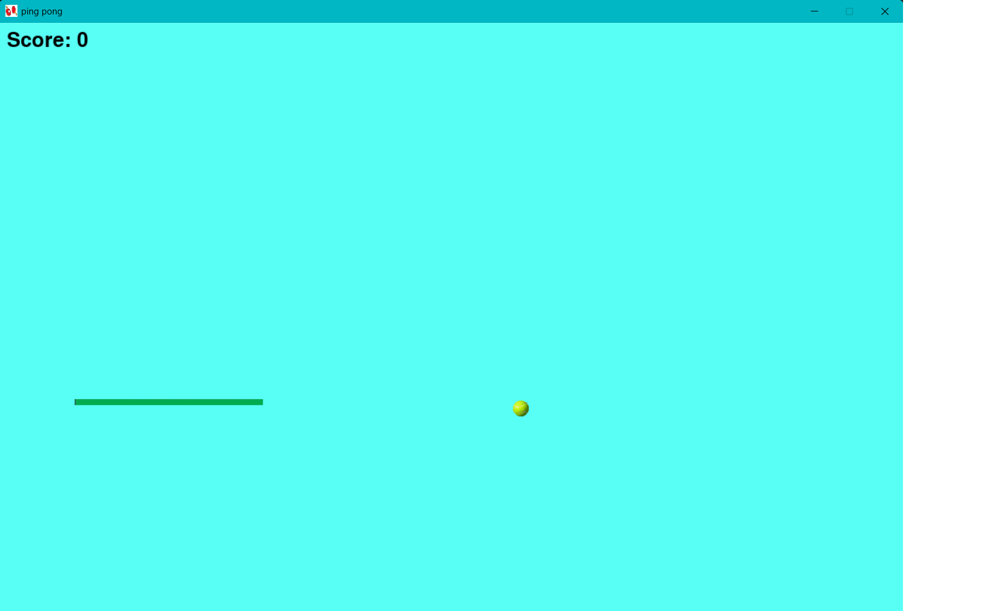

# Ping Pong Game

A simple 2D Ping Pong game built with Python and Pygame, featuring paddle controls, ball physics, collision detection, scoring, sound effects, dynamic backgrounds, and game restart functionality.

## Description

This project is a simple Ping Pong game where the player controls a paddle and tries to keep the ball from reaching the bottom of the screen.

The game includes ball movement, paddle collision detection, scoring, sound effects, dynamic background colors, and a game-over system.

## Technologies

- Python
- Pygame

## Features

- Paddle controlled with the keyboard
- Automatic ball movement
- Horizontal wall bouncing
- Paddle collision detection
- Dynamic scoring system
- Randomized background colors
- Paddle-hit sound effects
- Game-over state
- Space-to-restart functionality
- Random ball spawn position on restart
- Paddle boundary restrictions

## Controls

- **Left Arrow** — Move the paddle left
- **Right Arrow** — Move the paddle right
- **Space** — Restart the game after losing
- **Mouse Click** — Randomize the background color

## Challenges

One of the main challenges of this project was implementing collision detection between the ball and paddle.

Another challenge was creating the game-over and restart system while keeping the game responsive.

## What I Learned

Through this project, I learned how to:

- Create a game using Pygame
- Handle keyboard and mouse input
- Detect collisions between objects
- Create scoring systems
- Add sound effects
- Use random values in games
- Manage game states
- Work with game assets

## Status

Completed

## Future Improvements

- Add multiple difficulty levels
- Add an AI opponent
- Add more sound effects
- Add a start menu
- Add improved visual effects
- Add high-score saving

## Project Preview

The image below shows the game.



## Installation

Clone the repository:

```bash
git clone https://github.com/Genius-Progarmmer/Impossible-Ping-Pong.git
